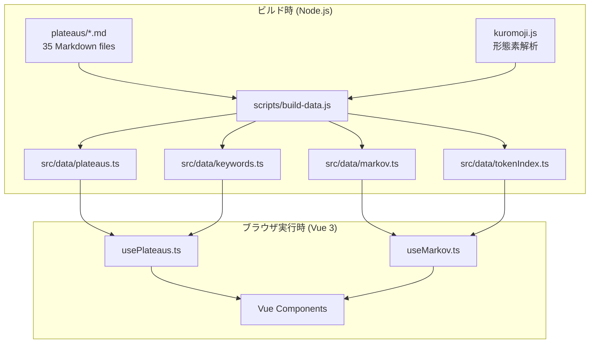

# PROJECT.md — LLM 向けプロジェクト理解ガイド

> このドキュメントは、LLM（大規模言語モデル）がこのプロジェクトのコードベースを理解するために最適化されています。

## プロジェクトの目的

チューリングマシンと詩学の交差をテーマにした 35 編の連作テキスト群（「プラトー」）を、非線形に探索できるインタラクティブ Web アプリケーション。ドゥルーズ＆ガタリの「千のプラトー」を霊感源に、テキストをネットワークとして横断する読書体験を提供する。

---

## アーキテクチャ概要



---

## データフロー

### 1. ソースデータ: `plateaus/*.md`

各ファイルは YAML frontmatter + Markdown body:

```yaml
---
id: 9
title: テープの上の詩
cluster: 1
clusterName: 計算×詩の交差
linksTo: [1, 3, 14, 19, 30]
---
本文テキスト... §1 への参照... 【マルコフ連鎖】のようなキーワード...
```

### 2. ビルドスクリプト: `scripts/build-data.js`

`node scripts/build-data.js` で以下の 4 ファイルを自動生成:

| 生成ファイル    | 内容                                       | サイズ目安 |
| --------------- | ------------------------------------------ | ---------- |
| `plateaus.ts`   | 全プラトーのメタデータ + 本文              | ~300KB     |
| `keywords.ts`   | 上位 300 キーワード（語 → 出現プラトーID） | ~15KB      |
| `markov.ts`     | マルコフ連鎖遷移テーブル（3,599 トークン） | ~200KB     |
| `tokenIndex.ts` | 全内容語の逆引きインデックス（2,135 語）   | ~60KB      |

#### マルコフ連鎖の構築手順

1. 全 35 プラトーの本文を句点・改行で文に分割
2. 各文を **kuromoji.js** で形態素解析
3. **内容語**（名詞・動詞・形容詞・副詞）を保持
4. **助詞・助動詞**は前の語に結合（例: `計算` + `は` → `計算は`）
5. ビグラム遷移テーブルを構築
6. 各トークンの上位 12 遷移を保持

---

## 状態管理: `usePlateaus.ts`

Composition API ベースのグローバルシングルトン。モジュールスコープの `ref` を複数の Vue コンポーネントで共有する。

### リアクティブ状態

```typescript
currentId: Ref<number | null>; // 現在表示中のプラトー ID
trail: Ref<number[]>; // 読書軌跡（訪問順のプラトー ID 列）
activeCluster: Ref<number | null>; // クラスタフィルター
showWordField: Ref<boolean>; // ワードフィールド表示/非表示
highlightWord: Ref<string | null>; // テキストパネルでマーカー強調する語
selectedKeyword: Ref<string | null>; // ワードフィールドで選択中のキーワード
poemTrail: Ref<string[]>; // 軌跡詩（クリックしたキーワード列）
```

### 主要アクション

```typescript
navigateTo(id); // プラトー遷移 + トレイル追加
navigateWithHighlight(id, word); // 遷移 + キーワードマーカー強調
selectKeyword(word); // ワードフィールド内のキーワード選択
addToPoemTrail(word); // 軌跡詩に語を追加
getKeywordSnippet(id, word); // あるプラトー内でのキーワード前後スニペット取得
```

---

## マルコフ連鎖: `useMarkov.ts`

### 型定義

```typescript
interface PoemToken {
  text: string; // トークンのテキスト（助詞結合済み）
  isKeyword: boolean; // TOKEN_INDEX に存在する内容語か
  prevToken: string | null; // マルコフ連鎖の前トークン (分岐計算用)
  probability: number; // このトークンが選ばれた確率 (0-1)
}

interface TokenAlternative {
  text: string;
  probability: number;
  isKeyword: boolean;
  isSelected: boolean; // 現在選択されている候補か
}
```

### 関数

```typescript
generatePoem(seedWord, lines=3, maxTokensPerLine=8): PoemLine[]
  // 種語から出発してマルコフ連鎖で詩を生成
  // 各トークンに prevToken と probability を付与

getAlternatives(prevToken): TokenAlternative[]
  // あるトークン位置で選びうる全候補と確率を返す
  // prevToken === null の場合はスターター候補を返す

getKeywordFromToken(text): string | null
  // TOKEN_INDEX (2,135 語) から最長一致でキーワードを検出

getPlateauIdsForToken(word): number[]
  // ある語が出現するプラトー ID の配列を返す
```

---

## Vue コンポーネント構成

```
App.vue
├── header
│   ├── SearchBox.vue         # キーワード検索 + ドロップダウン
│   ├── 🎲 DiceButton          # ランダムナビゲーション
│   ├── ◉ WordFieldToggle     # ワードフィールド表示切替
│   └── ClusterFilter.vue     # 7 クラスタのカラードットフィルター
│
├── main (左右分割, ドラッグで幅調整)
│   ├── #graphPanel
│   │   └── NetworkGraph.vue   # D3 フォースグラフ
│   │
│   └── #textPanel
│       ├── TextPanel.vue      # テキスト表示 + リンク
│       └── WordField.vue      # タグクラウド + 詩生成 (条件表示)
│
├── TrailBar.vue               # フッター: 読書軌跡
└── HoverPreview.vue           # フローティング: ホバープレビュー
```

### 主要コンポーネントの役割

#### `NetworkGraph.vue`

- D3 フォースシミュレーションで 35 ノード + リンクを描画
- `@hover(id, event)` / `@hover-end` を emit → `App.vue` 経由で `HoverPreview` に接続
- クラスタフィルター、トレイルエッジ（オレンジ）のリアクティブ描画

#### `TextPanel.vue`

- `processBody()` で本文 HTML 変換:
  - `§XX` → クリッカブルリンク
  - `【keyword】` → キーワードスパン
  - `highlightWord` → `<mark class="word-highlight">` マーカー強調
- バックリンク / フォワードリンクのチップ表示

#### `WordField.vue` (最も複雑なコンポーネント)

- **タグクラウド**: 上位 40 キーワード、サイズ = 重要度
- **生成詩タブ**: マルコフ連鎖による自動生成
  - 各トークンに確率バッジ（上付き `%`）
  - ホバー → マルコフ分岐ツールチップ（Teleport で body に配置）
  - クリックでトークンすり替え（次トークンの確率も連鎖更新）
  - ↑↓ キーボード操作 / Enter で選択 / Escape で閉じる
- **軌跡詩タブ**: クリックしたキーワードの蓄積
- **✏️ 編集モード**: textarea で自由編集
- **関連プラトーパネル**: TOKEN_INDEX から該当プラトーを検索

---

## スタイリング

- `src/styles/main.css` — グローバル CSS（ダークテーマ, CSS 変数ベース）
- 各コンポーネントに `<style scoped>` — コンポーネントローカル CSS
- `WordField.vue` は Teleport されたツールチップ用に `<style>` (非 scoped) も持つ
- カラーパレット:
  - アクセント: `#6c8cff`（青紫）
  - キーワード: `#ffd76c`（金黄）
  - 種語: `#6cffc0`（グリーン）
  - 警告/削除: `#ff6b8a`（ピンク）

---

## クラスタ定義

| ID  | 名前                         | 色        | 含まれるプラトーの例                     |
| --- | ---------------------------- | --------- | ---------------------------------------- |
| 1   | 計算×詩の交差                | `#ff6b8a` | §9 テープの上の詩, §3 アルゴリズム的芸術 |
| 2   | チューリングの人物と思想     | `#ffa06c` | §2 チューリングの生涯, §4 エニグマ       |
| 3   | チューリングマシンの構造     | `#6ce0ff` | §1 万能機械, §5 計算可能性               |
| 4   | 詩学の展開                   | `#a78bfa` | §19 マラルメ, §20 ソシュール             |
| 5   | 記号操作の哲学               | `#6cffc0` | §26 デリダ, §27 ヴィトゲンシュタイン     |
| 6   | Code Poetry・ウリポ・esolang | `#ffdb6c` | §30 ウリポ, §32 電子文学                 |
| 7   | 横断的プラトー               | `#ff8cf0` | §35 交差する軌跡                         |

---

## 開発ワークフロー

```bash
# 1. データ再生成（プラトーテキスト変更時）
node scripts/build-data.js

# 2. 開発サーバー起動
npm run dev      # → http://localhost:5173/

# 3. プロダクションビルド
npm run build    # → dist/
```

## 注意事項

- `src/data/` 配下のファイルは**自動生成**のため手動編集禁止
- kuromoji.js の辞書 (`node_modules/kuromoji/dict/`) はビルド時のみ使用、ブラウザにはバンドルされない
- 全処理がクライアントサイドで完結（外部 API なし）→ GitHub Pages で静的デプロイ可能
